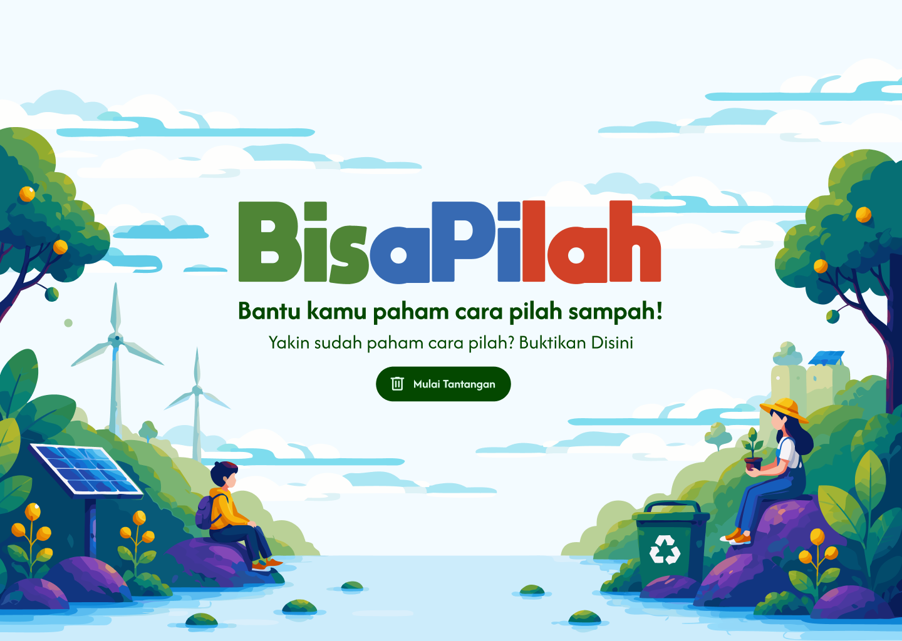

# BisaPilah - Gerakan Zero Waste



**BisaPilah** adalah website edukasi interaktif bertema **Gerakan Zero Waste** yang dirancang untuk meningkatkan kesadaran masyarakat tentang pentingnya pemilahan sampah. Dibuat untuk lomba web design, website ini menggabungkan konten edukasi dengan mini-game sortir sampah yang menyenangkan, semuanya berjalan 100% di sisi klien tanpa backend.

---

## 🎯 Fungsi Aplikasi

Website ini memiliki dua tujuan utama:

1. **Edukasi Pemilahan Sampah** - Memberikan informasi tentang jenis-jenis sampah (Organik, Anorganik, B3/Berbahaya, Daur Ulang), cara memilahnya, serta tips gaya hidup Zero Waste yang bisa diterapkan sehari-hari.

2. **Game Sortir Sampah** - Mini-game interaktif di mana item sampah muncul satu per satu dan pengguna harus memasukkannya ke tong sampah yang sesuai kategorinya. Tersedia feedback langsung (animasi + skor) untuk pengalaman belajar yang menyenangkan.

---

## 🛠️ Tech Stack

| Teknologi | Versi | Keterangan |
|---|---|---|
| [Next.js](https://nextjs.org/) | 16.2.9 | Framework React dengan App Router, output statis |
| [React](https://react.dev/) | 19.2.4 | Library UI utama |
| [TypeScript](https://www.typescriptlang.org/) | ^5 | Strict mode, semua file `.tsx`/`.ts` |
| [Tailwind CSS](https://tailwindcss.com/) | ^4 | Styling utility-first via `@theme inline` di `globals.css` |
| [Anime.js](https://animejs.com/) | ^4.5.0 | Animasi splash screen, transisi section, dan feedback game |

---

## 📁 Struktur Folder

```
sdgs-creativeweb/
├── public/
│   ├── fonts/               # Font kustom (Moon Get Heavy)
│   └── images/
│       ├── section/         # Aset gambar per section (home, games, pills, choice)
│       └── splash/          # Aset gambar untuk splash screen
│
└── src/
    ├── app/
    │   ├── layout.tsx        # Root layout — wrapping splash screen & metadata global
    │   ├── page.tsx          # Home / landing page (Hero, Game, Fakta, Aksi)
    │   ├── globals.css       # Global styles + konfigurasi Tailwind CSS v4
    │   └── choicetest/       # Halaman pengujian komponen (development only)
    │
    ├── components/
    │   ├── sections/              # Komponen section-level untuk halaman utama
    │   │   ├── HeroSection.tsx    # Hero banner dengan CTA dan animasi
    │   │   ├── GameSection.tsx    # Wrapper section mini-game sortir sampah
    │   │   ├── FactSection.tsx    # Section fakta & informasi seputar sampah
    │   │   ├── AksiSection.tsx    # Section ajakan aksi Zero Waste
    │   │   └── ChoiceSection.tsx  # Section pilihan kategori sampah
    │   │
    │   └── ui/                    # Komponen UI reusable
    │       ├── SplashScreen.tsx   # Animasi splash screen saat pertama load
    │       ├── TrashBin.tsx       # Komponen tong sampah (target drop di game)
    │       ├── TrashItem.tsx      # Komponen item sampah (draggable/clickable di game)
    │       └── CardModal.tsx      # Modal card untuk konten edukasi detail
    │
    ├── data/
    │   └── wasteTypes.ts     # Sumber data utama: daftar sampah, kategori, ikon, deskripsi
    │
    ├── hooks/
    │   ├── useGameLogic.ts   # Hook logika game (skor, state item aktif, feedback benar/salah)
    │   └── useDrag.ts        # Hook drag-and-drop untuk interaksi game
    │
    ├── lib/
    │   └── gameUtils.ts      # Helper murni: shuffle array, kalkulasi skor, utilitas game
    │
    └── types/
        └── images.d.ts       # Type declaration untuk import file SVG/gambar
```

---

## 🚀 Instalasi & Menjalankan Aplikasi

### Prasyarat

Pastikan sudah menginstall [Node.js](https://nodejs.org/) (versi 18 atau lebih baru).

### 1. Clone Repository

```bash
git clone https://github.com/Thoriqfm/BisaPilah-ByFest26.git
cd BisaPilah-ByFest26
```

### 2. Install Dependencies

Proyek ini menggunakan **npm** sebagai package manager utama. Direkomendasikan menggunakan npm agar sesuai dengan `package-lock.json` yang ada.

```bash
# Direkomendasikan
npm install
```

> Alternatif dengan package manager lain (tidak direkomendasikan, bisa menyebabkan perbedaan versi):
> ```bash
> yarn install
> # atau
> pnpm install
> # atau
> bun install
> ```

### 3. Jalankan Development Server

```bash
npm run dev
```

Buka [http://localhost:3000](http://localhost:3000) di browser untuk melihat hasilnya.

### 4. Build untuk Produksi

```bash
npm run build
```

Output statis akan digenerate di folder `.next/` (atau `out/` jika dikonfigurasi `output: "export"`).

### Scripts yang Tersedia

| Script | Perintah | Keterangan |
|---|---|---|
| Development | `npm run dev` | Jalankan dev server dengan hot-reload |
| Build | `npm run build` | Build untuk produksi |
| Start | `npm run start` | Jalankan hasil build secara lokal |
| Lint | `npm run lint` | Cek kualitas kode dengan ESLint |

---

## 🎮 Cara Bermain (Mini-Game)

1. Scroll ke bagian **Game** di halaman utama.
2. Item sampah akan muncul satu per satu di layar.
3. **Drag** item ke tong sampah yang sesuai, atau **klik** item lalu **klik tong** tujuan (mendukung mobile & keyboard).
4. Dapatkan poin untuk setiap jawaban benar, skor ditampilkan real-time.
5. Skor akan reset saat halaman di-reload (tidak ada persistensi, sesuai aturan lomba).

---

## 📝 Catatan Pengembangan

- Semua data sampah terdefinisi di satu tempat: `src/data/wasteTypes.ts`.
- Tidak ada backend, API route, atau database, 100% frontend statis.
- Gunakan `"use client"` di bagian atas file komponen yang menggunakan hooks, animasi, atau event handler.
- Animasi anime.js selalu dibungkus dalam `useEffect` dengan cleanup untuk mencegah memory leak.
